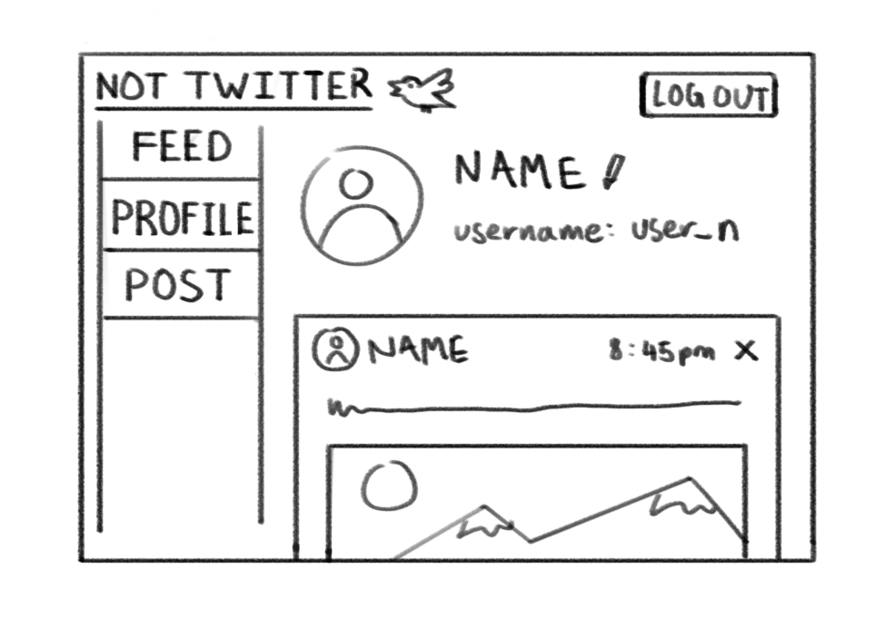
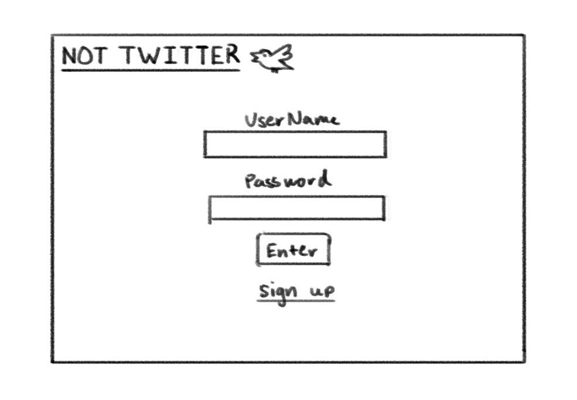
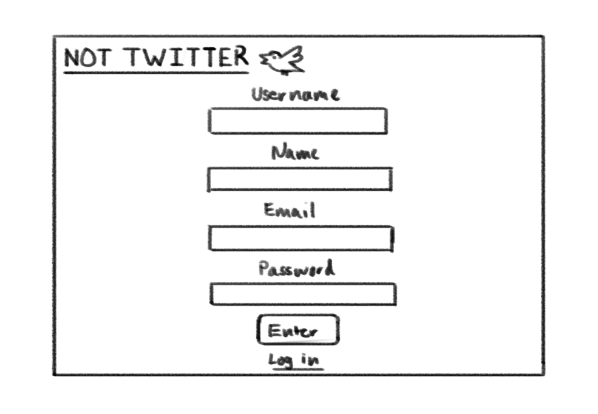
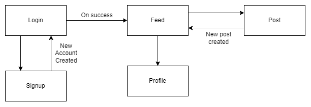

# Not Twitter

## Overview

Not Twitter is like Twitter but simpler. You'll be able to make an account, post a tweet, delete your old posts and see what other people post.

## Data Model

The application will store Users and Tweets

- users can have many tweets
- posts can have text and/or images

An Example User:

```javascript
{
  username: "not_twitter_user",
  hash: // a password hash,
  posts: // an array of references to Post documents
  name: "James"
}
```

An Example Tweet with Embedded Items:

```javascript
{
  user_id: // a reference to a User object
  tweet: "I posted something!", //or null if user does not write text
  createdAt: // timestamp
}
```

## [Link to Commented First Draft Schema](db.js)

## Wireframes

/feed - page for showing posts from all users ordered by time stamp


/profile - page for your profile information and all your previous posts



/post - page for creating a new Not Twitter post


/login - page for logging into your account



/signup - page for creating a new account



## Site map



## User Stories or Use Cases

1. As non-registered user, I can make a new account with the site.
2. As a user, I can log in to the site.
3. As a logged in user, I can make a new post.
4. As a logged in user, I can view all of my previous posts.
5. As a logged in user, I can delete one of my old posts.
6. As a logged in user, I can see posts made by other people.

## Research Topics

- (3 points) Integrate user authentication
  - Use passport for user authentication
  - And account has been made for testing
- (2 points) Use Heroku to deploy
  - Heroku allows for the site to be accessible anytime without being hosted locally
  - Allows many users can access it at once
  - Learn MongoCLI to upload to Heroku github
- (2) Use MongoDB Atlas
  - For storing collections of data
  - Good for managing different user data
  - Allows for easy linking to heroku
- (1) Add security for forms and account login
  - Salt passwords to store on MongoDB
  - Include form protection to prevent application from crashing

8 points total out of 8 required points

## [Link to Initial Main Project File](app.js)

## Annotations / References Used

1. https://www.freecodecamp.org/news/how-to-deploy-an-application-to-heroku/
2. https://www.mongodb.com/developer/how-to/use-atlas-on-heroku/#get-your-atlas-cluster-connection-string
3. https://stackoverflow.com/questions/38820251/how-is-req-isauthenticated-in-passport-js-implemented
4. https://www.npmjs.com/package/passport
